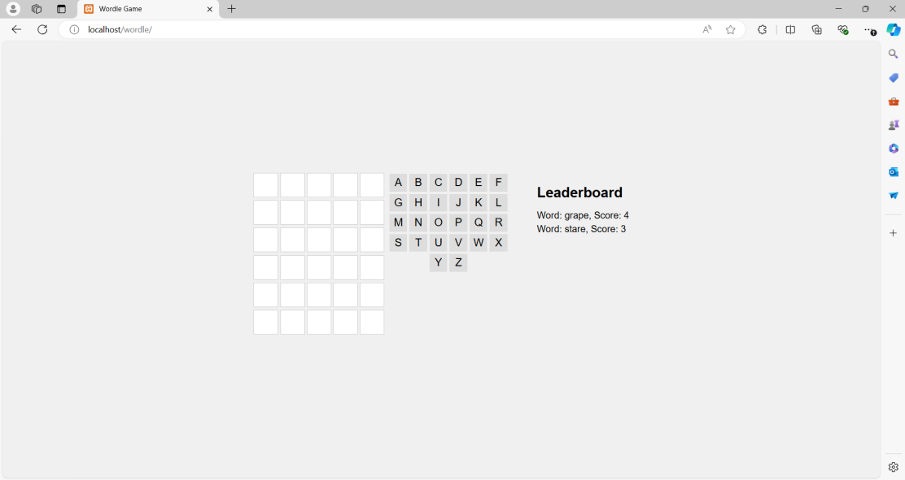
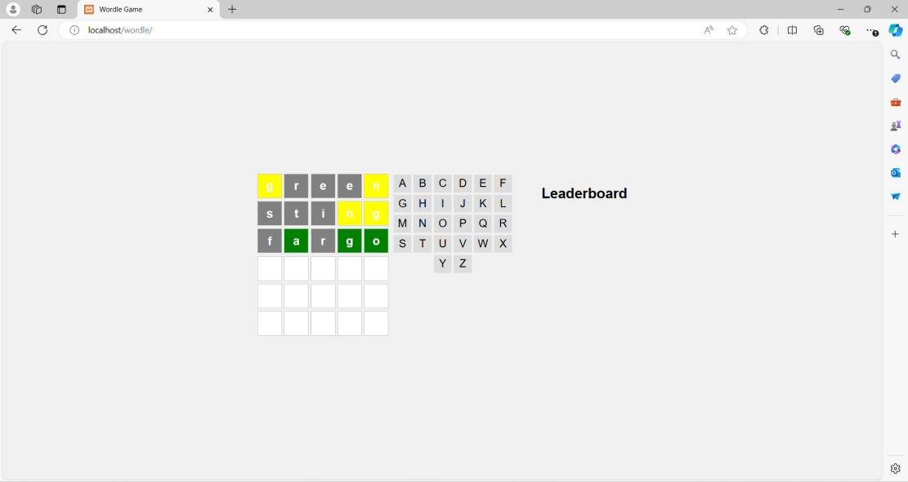
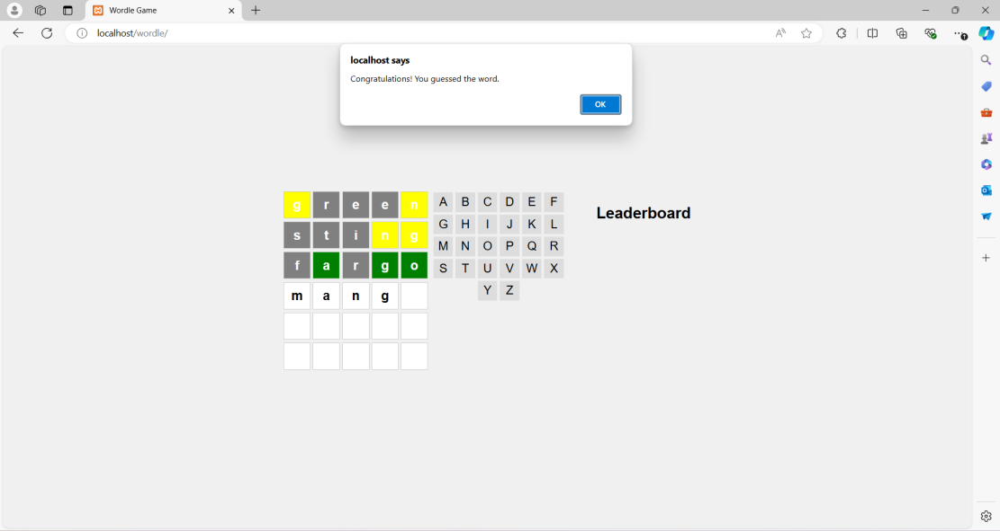

# Wordle Game

## Overview
This is a Wordle game implemented with HTML, CSS, JavaScript, and a PHP server component for managing game state and scoring.

## How to Play
1. Click the "Start Game" button to begin a new game.
2. Use the on-screen keyboard to guess letters in the hidden word.
3. You have 6 guesses to find the word.
4. Correct letters will be revealed in the word, while incorrect letters will reduce your remaining guesses.

## Leaderboard
- The top 10 scores are displayed in the leaderboard section.

## Screenshots

## Installation
1. Clone the repository: `git clone ellitraboulsi/wordle`
2. Ensure you have a PHP server running.
3. Open `index.html` in your browser to start the game.

## Credits
- Developed by Elli Traboulsi and Steven Yang
